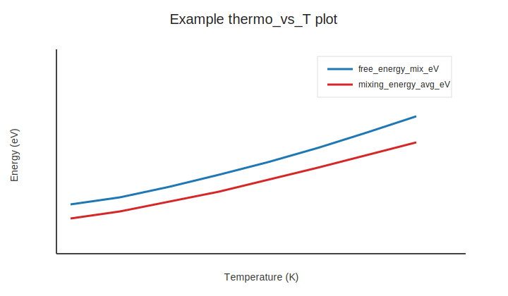

# Figure gallery

Use the plotting CLI to regenerate key figures from an existing run:

```bash
ganmg plot --run-id demo --kind thermo
```

The command writes figures into the run-local gallery directory:

- `runs/demo/figures/thermo_vs_T.png`

Example thermodynamic figure:



For a fully self-contained, synthetic-data walkthrough (public API only), see:

- `docs/examples/thermo_analysis_synthetic.ipynb`
